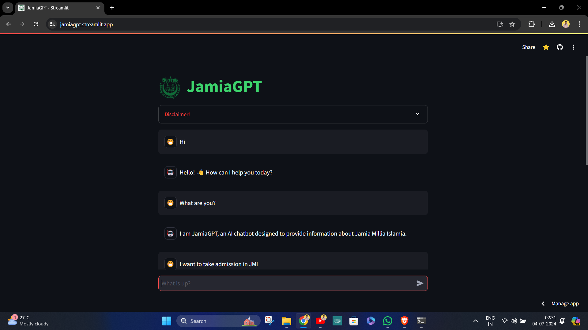
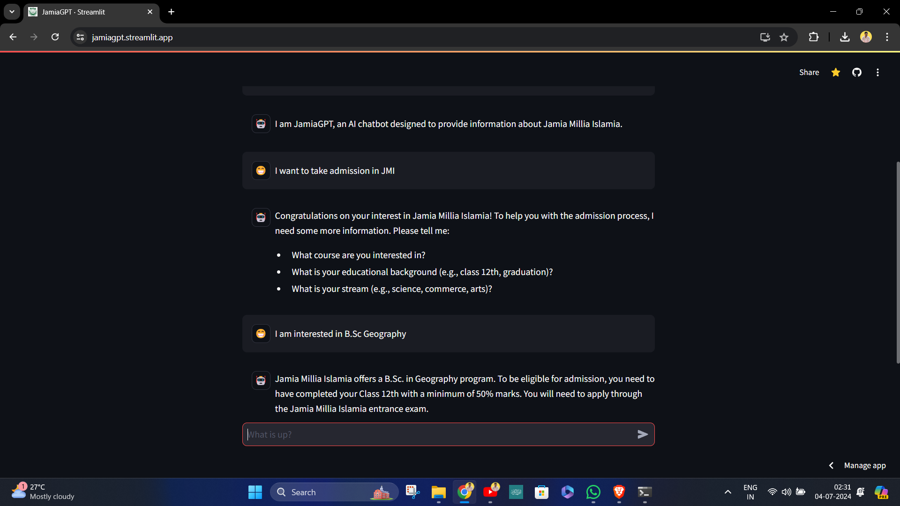

# JamiaGPT 

JamiaGPT is a web-based chat application powered by AI, designed to provide information and engage in roleplay conversations related to Jamia Millia Islamia.
[🔗JamiaGPT](https://jamiagpt.streamlit.app/)

## Screenshots

<p align="center">
  
  
</p>

## Features

- **AI Chat Interface:** Engage in roleplay conversations with JamiaGPT.
- **Information Retrieval:** Retrieve relevant information based on user queries.
- **Disclaimer:** Warns users about the model's current development stage and potential limitations.

## Technologies Used

- **Streamlit:** Web framework for creating interactive web applications with Python.
- **LangChain:** Library for building AI chat applications, incorporating:
  - **GoogleGenerativeAI:** For generating AI responses.
  - **HuggingFace Transformers:** Used for embeddings and inference.
  - **FAISS:** Fast similarity search for handling document retrieval.
- **Python Libraries:** Including shelve for data storage.

## Setup Instructions

1. **Clone the Repository:**
```bash
git clone https://github.com/confused-soul/JamiaGPT.git
cd JamiaGPT
```

2. **Install Dependencies:**
```bash
pip install -r requirements.txt
```

3. **Set Up Secrets:**
- Ensure you have configured your secrets for Gemini API and Inference API keys in your Streamlit secrets manager.

4. **Run the Application:**
```bash
streamlit run app.py
```

5. **Interact with JamiaGPT:**
- Open your web browser and navigate to the provided local host URL.
- Start interacting by entering queries related to Jamia Millia Islamia.

## Usage

- **Chat Interface:** Enter questions or engage in roleplay with JamiaGPT.
- **Feedback:** Provide feedback on responses to improve the model.

## Contributing

Contributions are welcome! Please follow the standard guidelines for contributions and open issues for feature requests or bug reports.
